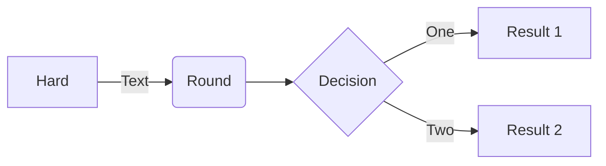

# ACES Backend

Build with laravel 9 + MySQL Database

## Deployment

https://aces.umn.ac.id/backend

for api -> https://aces.umn.ac.id/backend/api
## Used By

This project is used by ACES UMN official website (https://aces.umn.ac.id)

## Usage/Examples

#### Checkslug

```javascript
<script>
    const title = document.querySelector('#title'); const slug =
    document.querySelector('#slug'); title.addEventListener('change', function()
    {fetch(
        "https://aces.umn.ac.id/backend/api/member/labs_checkSlug?title=" +
            title.value
    )
        .then((response) => response.json())
        .then((data) => (slug.value = data.slug))}
    );
</script>
```

#### Use JWT for authorization

use route parameter

```javascript
http://aces-backend.matthewbd.my.id.test/api/member/ticket?token={access_token}
```

or use **_bearer token_** for authorization header

Note: access token last for 60 minutes, after that use /refresh api for get new access token

## API Documentation

#### Get All Posts

```
  GET /api/posts
```

#### Get All post by search

```
  GET /api/posts?search={post.title or post.body}
```

#### Get All post by category

```
  GET /api/posts?category={category.slug}
```

#### Get All post categories

```
  GET /api/categories
```

#### Get Post (detailed)

```
  GET /api/posts/{slug}
```

#### Get All ACES Open Projects

```
  GET /api/openprojects
```

#### Get All ACES Open Projects by search

```
  GET /api/openprojects?search={openproject.title or openproject.body}
```

#### Get ACES Open Project (detailed)

```
  GET /api/openprojects/{slug}
```

#### Get All ACES Labs Repository

```
  GET /api/labs
```

#### Get All ACES Labs Repository by search

```
  GET /api/labs?search={repository.title or repository.body}
```

#### Get All ACES Labs Repository by labs categories

```
  GET /api/labs?labscategory={labscategory.slug}
```

#### Get ACES Labs Repository (detailed)

```
  GET /api/labs/{slug}
```

#### Get All ACES Labs categories

```
  GET /api/labs-categories
```

#### Get All ACES Generations

```
  GET /api/generations
```

#### Get All ACES Frontliners member

```
  GET /api/frontliners
```

#### Get All ACES Frontliners member by search

```
  GET /api/frontliners?search={frontliner.name}
```

#### Get All ACES Frontliners member by generations

```
  GET /api/frontliners?generation={generation.slug}
```

#### Post Contact Us

```
  POST /api/contactus
```

| Parameter | Type     | Description  |
| :-------- | :------- | :----------- |
| `name`    | `string` | **Required** |
| `email`   | `string` | **Required** |
| `title`   | `string` | **Required** |
| `body`    | `string` | **Required** |

#### Get Lecturers

```
  GET /api/lecturers
```

#### Get Website Configuration

```
  GET /api/websiteconfiguration
```

#### Get Website Gallery

```
  GET /api/websitegallery
```

## Auth API Reference

These auth system use JWT token for authorization. JWT expired in 60 minutes, use /refresh for get new access token.
See usage/example section for example.

#### Login

```
  POST /api/auth/login
```

| Parameter  | Type     | Description  |
| :--------- | :------- | :----------- |
| `email`    | `string` | **Required** |
| `password` | `string` | **Required** |

#### Register

```
  POST /api/auth/register
```

| Parameter         | Type     | Description  |
| :---------------- | :------- | :----------- |
| `name`            | `string` | **Required** |
| `username`        | `string` | **Required** |
| `email`           | `string` | **Required** |
| `password`        | `string` | **Required** |
| `passwordconfirm` | `string` | **Required** |

#### Me

Get logged account information

```
  POST /api/auth/me?token={access_token}
```

#### Refresh

```
  POST /api/auth/refresh?token={access_token}
```

use header "Accept" = "application/json" for request refresh access token

#### Logout

```
  POST /api/auth/logout?token={access_token}
```

#### Forgot Password

```
  POST /api/auth/forgot
```

| Parameter | Type     | Description  |
| :-------- | :------- | :----------- |
| `email`   | `string` | **Required** |

#### Reset Password

```
  POST /api/auth/reset_password/{Token}
```

| Parameter               | Type     | Description  |
| :---------------------- | :------- | :----------- |
| `email`                 | `string` | **Required** |
| `password`              | `string` | **Required** |
| `password_confirmation` | `string` | **Required** |

## Member API Reference

#### List Labs

```
  POST /api/member/labs?token={access_token}
```

#### Show Labs

```
  POST /api/member/labs/{labs_slug}?token={access_token}
```

#### Create Labs

```
  POST /api/member/labs_create?token={access_token}
```

Multipart/form
| Parameter | Type | Description |
| :-------- | :------- | :------------------------- |
| `title` | `string` | **Required** |
| `slug` | `string` | **Required**. use checkSlug function|
| `labscategory_id` | `string` | **Required** |
| `image` | `string` | **Required**. File|
| `body` | `string` | **Required** |

#### Update Labs

```
  POST /api/member/labs_update/{labs_slug}?token={access_token}
```

Multipart/form
| Parameter | Type | Description |
| :-------- | :------- | :------------------------- |
| `title` | `string` | **Required** |
| `slug` | `string` | **Required**. use checkSlug function|
| `labscategory_id` | `string` | **Required** |
| `image` | `string` | **Required**. File|
| `body` | `string` | **Required** |

Member can update their own posts, but not others

#### Delete Labs

```
  POST /api/member/labs_delete/{labs_slug}?token={access_token}
```

Member can delete their own posts, but not others

#### CheckSlug Labs

```
  POST /api/member/labs_checkSlug?title={title}&token={access_token}
```

#### List Image Folder

```
  POST /api/member/imagefolder?token={access_token}
```

#### Create Image Folder

```
  POST /api/member/imagefolder_create?token={access_token}
```

Multipart/form
| Parameter | Type | Description |
| :-------- | :------- | :------------------------- |
| `image` | `string` | **Required**. File|

#### Delete Image Folder

```
  POST /api/member/imagefolder_delete/{imagefolder_ID}?token={access_token}
```

Member can delete their own image, but not others

#### List Ticket

```
  POST /api/member/ticket?token={access_token}
```

#### Show Ticket

```
  POST /api/member/ticket/{ticket_slug}?token={access_token}
```

#### Create Ticket

```
  POST /api/member/ticket_create?token={access_token}
```

| Parameter | Type     | Description                                             |
| :-------- | :------- | :------------------------------------------------------ |
| `title`   | `string` | **Required**                                            |
| `slug`    | `string` | **Required**. use checkSlug function                    |
| `body`    | `string` | **Required**. Body can use HTML tag (summernote format) |

#### CheckSlug Ticket

```
  POST /api/member/ticket_checkSlug?title={title}&token={access_token}
```

## Update API Reference

#### Post Contact Us

```
  POST /api/contactus
```

| Parameter | Type     | Description  |
| :-------- | :------- | :----------- |
| `name`    | `string` | **Required** |
| `email`   | `string` | **Required** |
| `title`   | `string` | **Required** |
| `body`    | `string` | **Required** |

#### Get Lecturers

```
  GET /api/lecturers
```

#### Get Website Configuration

```
  GET /api/websiteconfiguration
```

#### Get Website Gallery

```
  GET /api/websitegallery
```

## Environment Variables

To run this project, you will need to add the following environment variables to your .env file

`APP_ENV`

`APP_URL`

`ASSET_URL`

## Run Locally

Make sure have PHP >= 8.1 (Minimum for laravel 9)

Clone the project

```bash
  git clone https://github.com/MatthewBrandon21/aces-backend
```

Go to the project directory

```bash
  cd aces-backend
```

Install dependencies

```bash
  composer update
  composer install
```

Configure database setting in .env

```bash
  DB_CONNECTION=mysql
  DB_HOST=127.0.0.1
  DB_PORT=3306
  DB_DATABASE=acesdatabase
  DB_USERNAME=root
  DB_PASSWORD=
```

Configure email smtp setting in .env

```bash
    MAIL_MAILER=smtp
    MAIL_HOST=mailhog
    MAIL_PORT=1025
    MAIL_USERNAME=null
    MAIL_PASSWORD=null
    MAIL_ENCRYPTION=null
    MAIL_FROM_ADDRESS="hello@example.com"
    MAIL_FROM_NAME="${APP_NAME}"
```

Generate JWT::secret

```bash
  php artisan jwt:secret
```

Seed database

```bash
  php artisan migrate:fresh --seed
```

Create Symlink

```bash
  php artisan storage:link
```

Start the server (or you can use valet)

```bash
  php artisan serve
```

## Support

For support, email matthew.brandon@student.umn.ac.id


